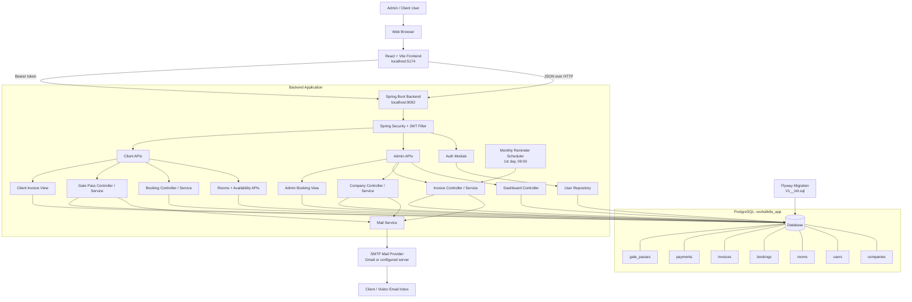
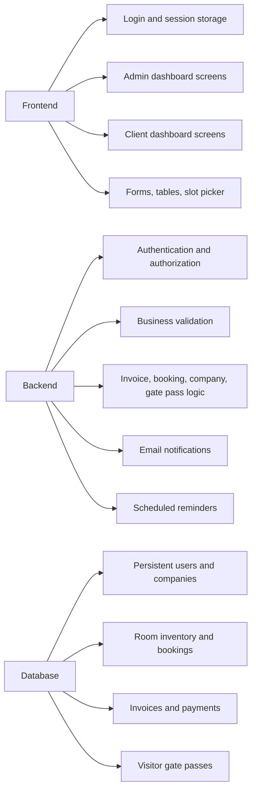
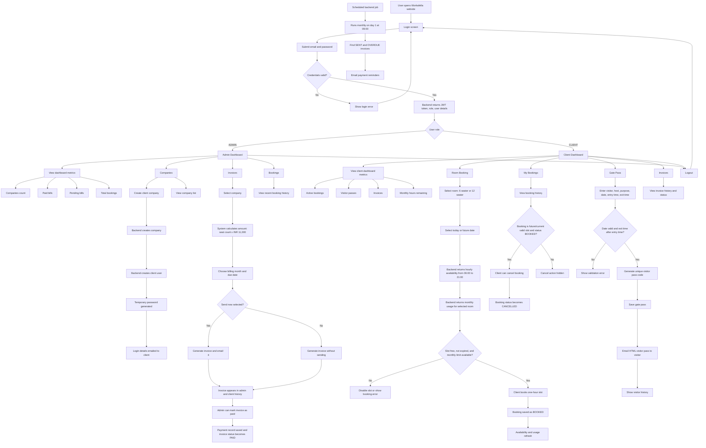
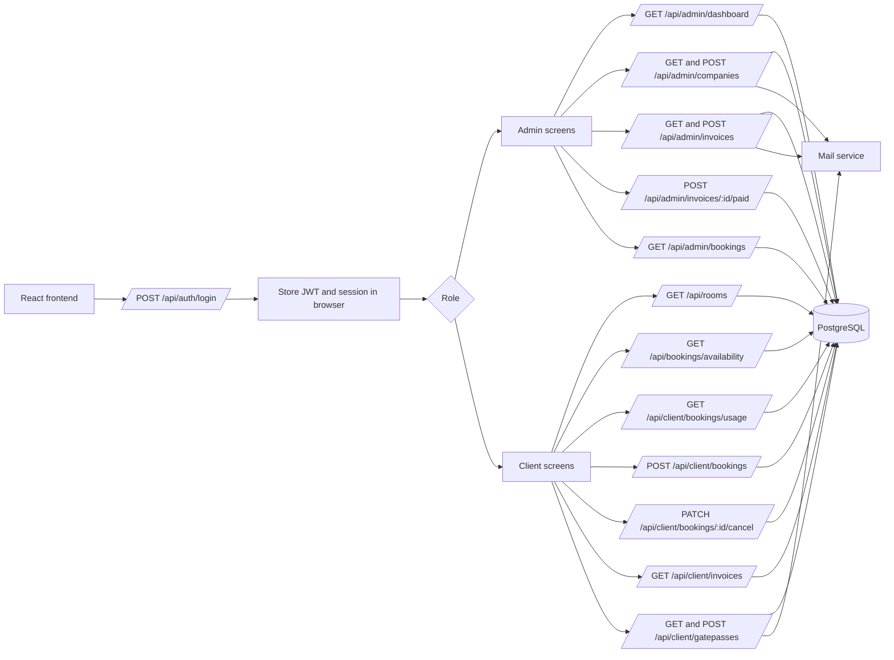

# Workafella Website Workflow Chart

## Architecture Diagram

```mermaid
flowchart TB
    U[Admin / Client User] --> B[Web Browser]
    B --> FE[React + Vite Frontend<br/>localhost:5174]

    FE -->|JSON over HTTP| API[Spring Boot Backend<br/>localhost:9092]
    FE -->|Bearer token| API

    subgraph Backend[Backend Application]
        API --> SEC[Spring Security + JWT Filter]
        SEC --> AUTH[Auth Module]
        SEC --> ADMIN[Admin APIs]
        SEC --> CLIENT[Client APIs]

        AUTH --> USERS[User Repository]

        ADMIN --> DASH[Dashboard Controller]
        ADMIN --> COMPANY[Company Controller / Service]
        ADMIN --> INVOICE[Invoice Controller / Service]
        ADMIN --> BOOKADMIN[Admin Booking View]

        CLIENT --> ROOMS[Rooms + Availability APIs]
        CLIENT --> BOOKING[Booking Controller / Service]
        CLIENT --> GATEPASS[Gate Pass Controller / Service]
        CLIENT --> CLIENTINV[Client Invoice View]

        COMPANY --> MAIL[Mail Service]
        INVOICE --> MAIL
        GATEPASS --> MAIL

        SCHED[Monthly Reminder Scheduler<br/>1st day, 09:00] --> INVOICE
    end

    subgraph Database[PostgreSQL: workafella_app]
        DB[(Database)]
        T1[companies]
        T2[users]
        T3[rooms]
        T4[bookings]
        T5[invoices]
        T6[payments]
        T7[gate_passes]
    end

    USERS --> DB
    DASH --> DB
    COMPANY --> DB
    INVOICE --> DB
    CLIENTINV --> DB
    ROOMS --> DB
    BOOKING --> DB
    BOOKADMIN --> DB
    GATEPASS --> DB

    DB --- T1
    DB --- T2
    DB --- T3
    DB --- T4
    DB --- T5
    DB --- T6
    DB --- T7

    MAIL --> SMTP[SMTP Mail Provider<br/>Gmail or configured server]
    SMTP --> EMAIL[Client / Visitor Email Inbox]

    FLYWAY[Flyway Migration<br/>V1__init.sql] --> DB
```

## High-Level Component Responsibilities

```mermaid
flowchart LR
    FE[Frontend] --> FE1[Login and session storage]
    FE --> FE2[Admin dashboard screens]
    FE --> FE3[Client dashboard screens]
    FE --> FE4[Forms, tables, slot picker]

    BE[Backend] --> BE1[Authentication and authorization]
    BE --> BE2[Business validation]
    BE --> BE3[Invoice, booking, company, gate pass logic]
    BE --> BE4[Email notifications]
    BE --> BE5[Scheduled reminders]

    DB[Database] --> DB1[Persistent users and companies]
    DB --> DB2[Room inventory and bookings]
    DB --> DB3[Invoices and payments]
    DB --> DB4[Visitor gate passes]
```

```mermaid
flowchart TD
    A[User opens Workafella website] --> B[Login screen]
    B --> C[Submit email and password]
    C --> D{Credentials valid?}
    D -- No --> E[Show login error]
    E --> B
    D -- Yes --> F[Backend returns JWT token, role, user details]
    F --> G{User role}

    G -- ADMIN --> AD[Admin Dashboard]
    G -- CLIENT --> CD[Client Dashboard]

    AD --> AD1[View dashboard metrics]
    AD1 --> AD1A[Companies count]
    AD1 --> AD1B[Paid bills]
    AD1 --> AD1C[Pending bills]
    AD1 --> AD1D[Total bookings]

    AD --> AC[Companies]
    AC --> AC1[Create client company]
    AC1 --> AC2[Backend creates company]
    AC2 --> AC3[Backend creates client user]
    AC3 --> AC4[Temporary password generated]
    AC4 --> AC5[Login details emailed to client]
    AC --> AC6[View company list]

    AD --> AI[Invoices]
    AI --> AI1[Select company]
    AI1 --> AI2[System calculates amount: seat count x INR 11,000]
    AI2 --> AI3[Choose billing month and due date]
    AI3 --> AI4{Send now selected?}
    AI4 -- Yes --> AI5[Generate invoice and email it]
    AI4 -- No --> AI6[Generate invoice without sending]
    AI5 --> AI7[Invoice appears in admin and client history]
    AI6 --> AI7
    AI7 --> AI8[Admin can mark invoice as paid]
    AI8 --> AI9[Payment record saved and invoice status becomes PAID]

    AD --> AB[Bookings]
    AB --> AB1[View recent booking history]

    CD --> CD1[View client dashboard metrics]
    CD1 --> CD1A[Active bookings]
    CD1 --> CD1B[Visitor passes]
    CD1 --> CD1C[Invoices]
    CD1 --> CD1D[Monthly hours remaining]

    CD --> CB[Room Booking]
    CB --> CB1[Select room: 6 seater or 12 seater]
    CB1 --> CB2[Select today or future date]
    CB2 --> CB3[Backend returns hourly availability from 06:00 to 21:00]
    CB3 --> CB4[Backend returns monthly usage for selected room]
    CB4 --> CB5{Slot free, not expired, and monthly limit available?}
    CB5 -- No --> CB6[Disable slot or show booking error]
    CB5 -- Yes --> CB7[Client books one-hour slot]
    CB7 --> CB8[Booking saved as BOOKED]
    CB8 --> CB9[Availability and usage refresh]
    CD --> CM[My Bookings]
    CM --> CM1[View booking history]
    CM1 --> CM2{Booking is future/current valid slot and status BOOKED?}
    CM2 -- Yes --> CM3[Client can cancel booking]
    CM3 --> CM4[Booking status becomes CANCELLED]
    CM2 -- No --> CM5[Cancel action hidden]

    CD --> CG[Gate Pass]
    CG --> CG1[Enter visitor, host, purpose, date, entry time, exit time]
    CG1 --> CG2{Date valid and exit time after entry time?}
    CG2 -- No --> CG3[Show validation error]
    CG2 -- Yes --> CG4[Generate unique visitor pass code]
    CG4 --> CG5[Save gate pass]
    CG5 --> CG6[Email HTML visitor pass to visitor]
    CG6 --> CG7[Show visitor history]

    CD --> CI[Invoices]
    CI --> CI1[View invoice history and status]

    AD --> L[Logout]
    CD --> L
    L --> B

    S[Scheduled backend job] --> S1[Runs monthly on day 1 at 09:00]
    S1 --> S2[Find SENT and OVERDUE invoices]
    S2 --> S3[Email payment reminders]
```

## Supporting API Flow

```mermaid
flowchart LR
    UI[React frontend] --> AUTH[/POST /api/auth/login/]
    AUTH --> JWT[Store JWT and session in browser]
    JWT --> ROLE{Role}

    ROLE --> ADMIN[Admin screens]
    ROLE --> CLIENT[Client screens]

    ADMIN --> A1[/GET /api/admin/dashboard/]
    ADMIN --> A2[/GET and POST /api/admin/companies/]
    ADMIN --> A3[/GET and POST /api/admin/invoices/]
    ADMIN --> A4[/POST /api/admin/invoices/:id/paid/]
    ADMIN --> A5[/GET /api/admin/bookings/]

    CLIENT --> C1[/GET /api/rooms/]
    CLIENT --> C2[/GET /api/bookings/availability/]
    CLIENT --> C3[/GET /api/client/bookings/usage/]
    CLIENT --> C4[/POST /api/client/bookings/]
    CLIENT --> C5[/PATCH /api/client/bookings/:id/cancel/]
    CLIENT --> C6[/GET /api/client/invoices/]
    CLIENT --> C7[/GET and POST /api/client/gatepasses/]

    A1 --> DB[(PostgreSQL)]
    A2 --> DB
    A3 --> DB
    A4 --> DB
    A5 --> DB
    C1 --> DB
    C2 --> DB
    C3 --> DB
    C4 --> DB
    C5 --> DB
    C6 --> DB
    C7 --> DB

    A2 --> MAIL[Mail service]
    A3 --> MAIL
    C7 --> MAIL
```
